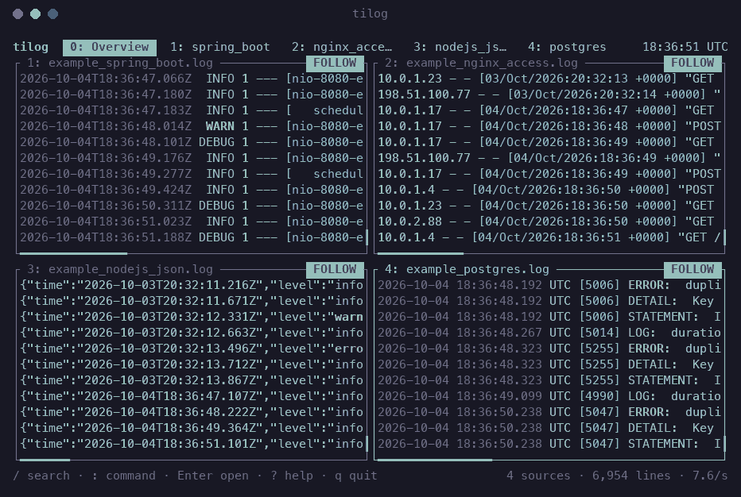
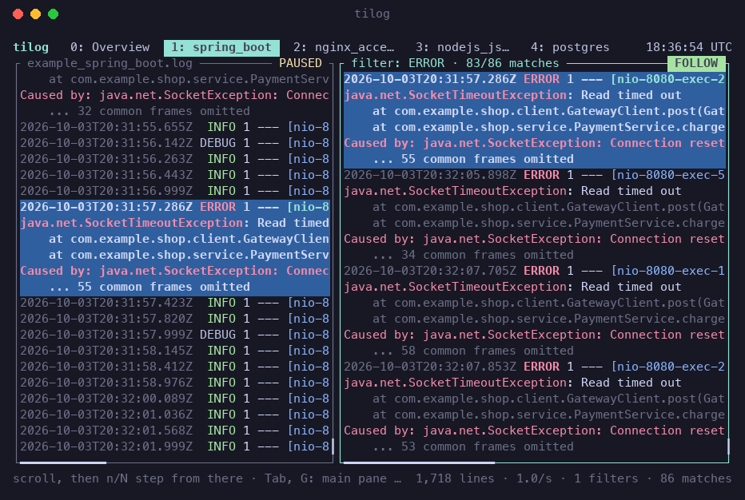

# tilog

[](https://github.com/maxwellscode/tilog/actions/workflows/ci.yml)
[](LICENSE)

**`tig` for logs:** a small, fast, read-only terminal viewer for live logs during a deployment
and for checking production errors afterwards. Written in Rust. [Homepage](https://maxwellscode.github.io/tilog/).

It feels like `less` and `tail`, works with no configuration, and never changes a log or a
server. If you know `less`, you already know most of it.



- **Live:** watch the logs of several VMs, containers and pods side by side during a deployment.
- **Review:** open the logs, jump between errors, filter, and save what you found.
- **A source** is a file, standard input, or any command that prints lines, so SSH, Docker,
  Kubernetes and `journalctl` all work like a local file.
- **Read-only:** it installs nothing on remote hosts and only runs `tail`, `ssh`, `docker` and
  `kubectl` the way you would.
- **Not a log platform:** no storage, indexing, alerting, dashboards or query language. For
  that, use a tool built for it (lnav for format parsing and SQL, or a hosted service).

## Install

**A release archive**, from the [releases page](https://github.com/maxwellscode/tilog/releases):
Linux (x86_64 and aarch64, static, so any distribution) and macOS (Intel and Apple silicon).
Unpack it and put `tilog` on your `PATH`; the archive also holds the manual page, in `man/`.

```sh
tar xzf tilog-0.1.0-x86_64-unknown-linux-musl.tar.gz
install -m 755 tilog-0.1.0-x86_64-unknown-linux-musl/tilog ~/.local/bin/
```

Check the download against `SHA256SUMS` from the same page (`shasum -a 256 -c SHA256SUMS --ignore-missing`).

**From source**, with Rust 1.88 or newer. tilog is not on crates.io yet:

```sh
cargo install --git https://github.com/maxwellscode/tilog
```

It runs on Linux and macOS (see [Platforms](#platforms)).

The manual page is built in, so that it can be installed with a cargo-installed binary too:

```sh
mkdir -p ~/.local/share/man/man1
tilog --print-man > ~/.local/share/man/man1/tilog.1
man tilog
```

## Usage

```sh
tilog app.log nginx.log                      # local files
tilog ssh:deploy@web1:/var/log/app.log       # remote file (reconnects when the link drops)
tilog docker:api kube:prod/web-0 cmd:'journalctl -fu app'
tilog ssh:web1:docker:api ssh:bastion:kube:shop/web-0   # docker / kubectl on another host, over ssh
tilog -s deploy                              # a saved session
kubectl logs -f web-0 | tilog                # anything piped in (or `tilog -`)
tilog app.log.2.gz                           # compressed logs are unpacked with gzip
```

Keys follow `less`: `j k Space b g G` scroll, `/` searches, `&` filters, `:` runs a command
(`:add`, `:merge`, `:save`, ...), `?` shows all keys, `1`-`9` open a source, `q` goes back.
In a filter pane, `n` / `N` step through its matches and the main pane shows each one in
its place in the file.



Colors and named sources live in `~/.config/tilog/config.toml`
(`tilog --print-config` prints the defaults). Example logs and a live writer for trying
it out are in [`examples/`](examples/).

## SSH logins

A host that accepts your key (or your agent) just works. If a login is refused, tilog lets
`ssh` ask its question **in the tile of that source**, as an ordinary `ssh` session would:

```
deploy@web1's password: ••••••
```

Type the answer and press Enter (Esc gives up, Tab moves to the tile of another source). The
same works for a key's passphrase, a one-time code, and the "unknown host key, continue?" question.

- The answer is kept in memory only, so that a dropped connection reconnects by itself. It is
  never written to disk or to a session file.
- A wrong answer is not retried: repeated failed logins are what locks an address out. Add the
  source again to try another one.
- A key is easier and safer for production hosts: `ssh-copy-id host`, or `ssh-add` for a key
  with a passphrase.
- Questions need OpenSSH 8.4 or later (current macOS, Ubuntu 22.04 and newer).

## Small and fast

Measured with a release build on a MacBook; `examples/live.sh` and the scripts in the test
suite reproduce most of it.

| | |
|---|---|
| Binary | 2.5 MB, no runtime |
| First log line on screen | about 12 ms after start, for a 10 KB file and a 1.1 GB file alike (it opens at the end) |
| Idle | 0.1 % CPU with one file, 0.3 % with nine sources: nothing is redrawn when nothing changed |
| Memory | 16 MB with a 1.1 GB file open, 21 MB with nine sources, 15 MB after 5 million lines through a pipe |
| Throughput | 5 million lines (490 MB) through a pipe in 3.2 s |
| Filter over a 1.1 GB file | 2.5 million matches found in about a second, 16 bytes per match |

Memory stays bounded whatever the input:

- A line is cut at 64 KiB (a note at its end says how much). A single 50 MB line costs 20 MB in
  total instead of gigabytes.
- Each source holds at most 32 MiB of text, however many lines that is.
- A file filter keeps at most 4 million matches and says so in its title.

Set `NO_COLOR=1` for a screen without color (reverse video marks what color marked).

## Platforms

Linux and macOS. On Windows, use WSL: the Linux build runs there unchanged. A native Windows
build is not supported yet (process handling and file identity use Unix APIs).

## Contributing

See [CONTRIBUTING.md](CONTRIBUTING.md): how to build and test, what belongs in tilog and what
does not, and a dev container for Linux. Changes are listed in [CHANGELOG.md](CHANGELOG.md).

## License

MIT, see [LICENSE](LICENSE).
